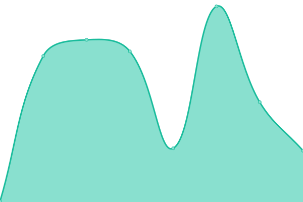

# [📈 Live Status](https://status.bnuy.zone): <!--live status--> **🟩 All systems operational**

This repository contains the open-source uptime monitor and status page for [Astra](https://astrabun.com), powered by [Upptime](https://github.com/upptime/upptime).

With [Upptime](https://upptime.js.org), you can get your own unlimited and free uptime monitor and status page, powered entirely by a GitHub repository. We use [Issues](https://github.com/astrabun/status.bnuy.zone/issues) as incident reports, [Actions](https://github.com/astrabun/status.bnuy.zone/actions) as uptime monitors, and [Pages](https://status.bnuy.zone) for the status page.

<!--start: status pages-->
<!-- This summary is generated by Upptime (https://github.com/upptime/upptime) -->
<!-- Do not edit this manually, your changes will be overwritten -->
<!-- prettier-ignore -->
| URL | Status | History | Response Time | Uptime |
| --- | ------ | ------- | ------------- | ------ |
|  [bnuy.zone](https://bnuy.zone) | 🟩 Up | [bnuy-zone.yml](https://github.com/astrabun/status.bnuy.zone/commits/HEAD/history/bnuy-zone.yml) | 

 185ms
     
 | 

<a href="https://status.bnuy.zone/history/bnuy-zone">99.82%</a>
    

|  [Astra Bun Links](https://astrabun.com) | 🟩 Up | [astra-bun-links.yml](https://github.com/astrabun/status.bnuy.zone/commits/HEAD/history/astra-bun-links.yml) | 

 117ms
     
 | 

<a href="https://status.bnuy.zone/history/astra-bun-links">100.00%</a>
    

|  [Astra Bun Art Gallery](https://art.astrabun.com) | 🟩 Up | [astra-bun-art-gallery.yml](https://github.com/astrabun/status.bnuy.zone/commits/HEAD/history/astra-bun-art-gallery.yml) | 

 62ms
     
 | 

<a href="https://status.bnuy.zone/history/astra-bun-art-gallery">100.00%</a>
    

<!--end: status pages-->

[**Visit our status website →**](https://status.bnuy.zone)

## 📄 License

- Powered by: [Upptime](https://github.com/upptime/upptime)
- Code: [MIT](./LICENSE) © [Astra](https://astrabun.com)
- Data in the `./history` directory: [Open Database License](https://opendatacommons.org/licenses/odbl/1-0/)
